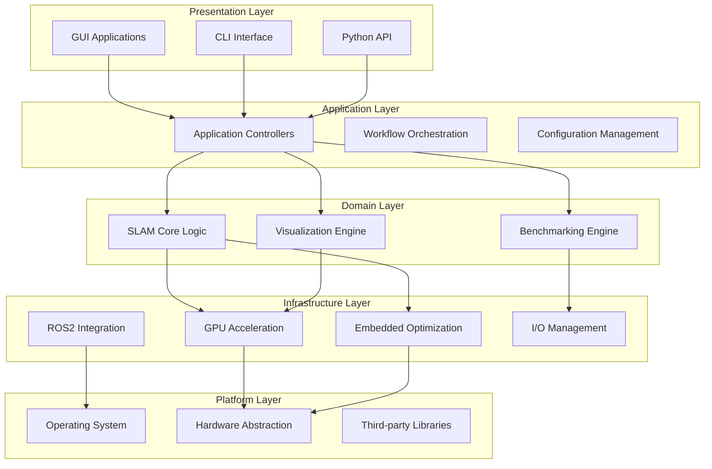
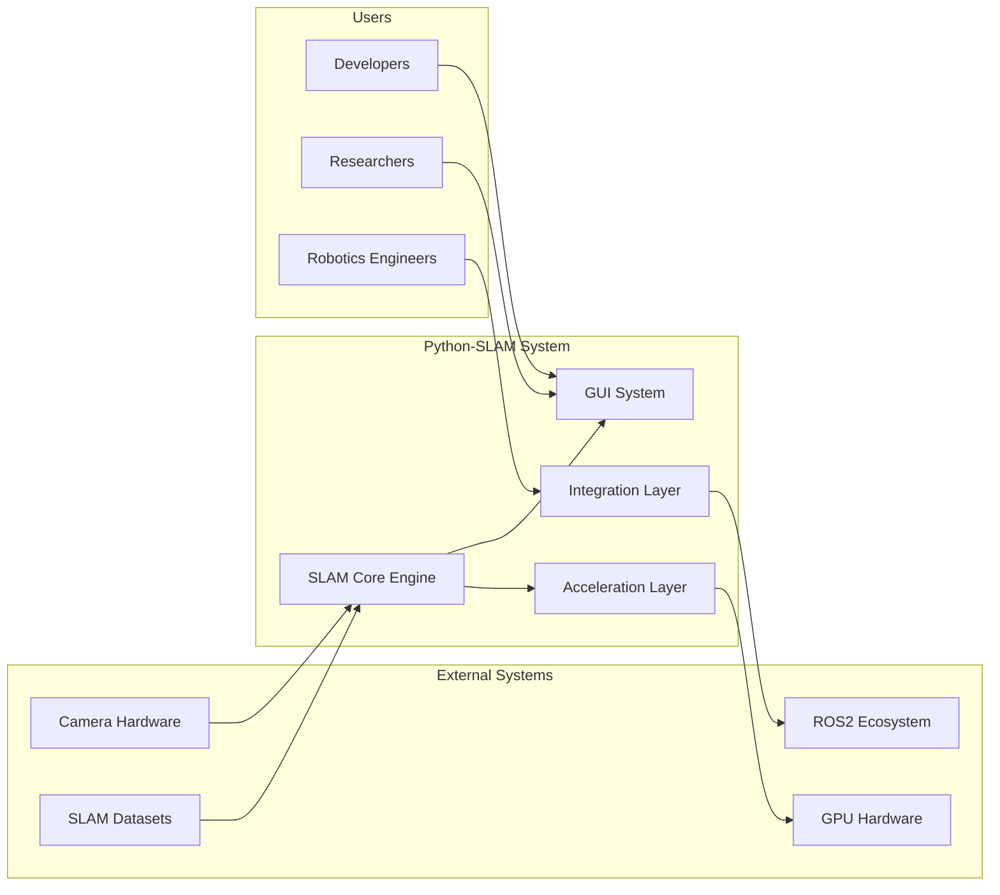
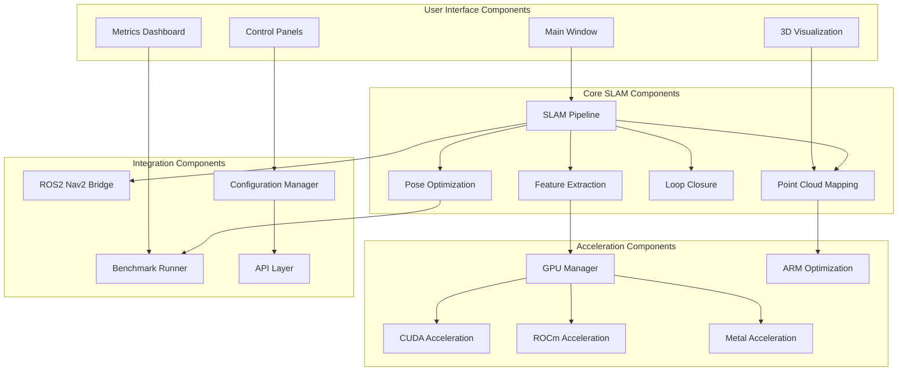
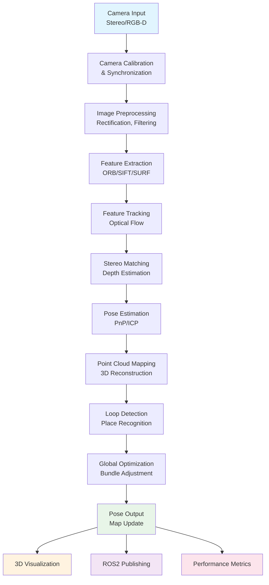
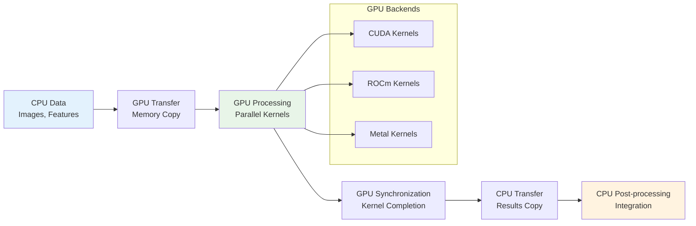
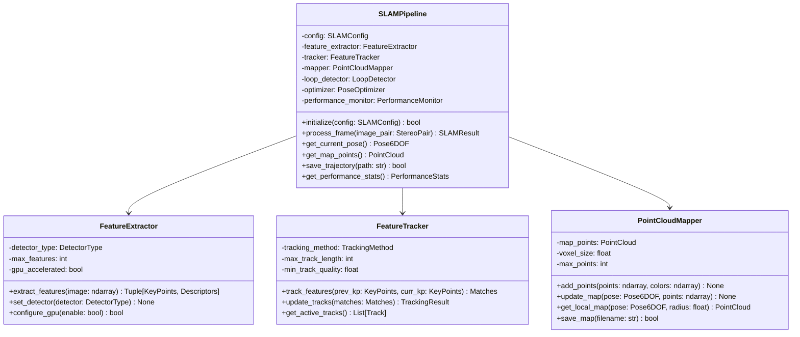
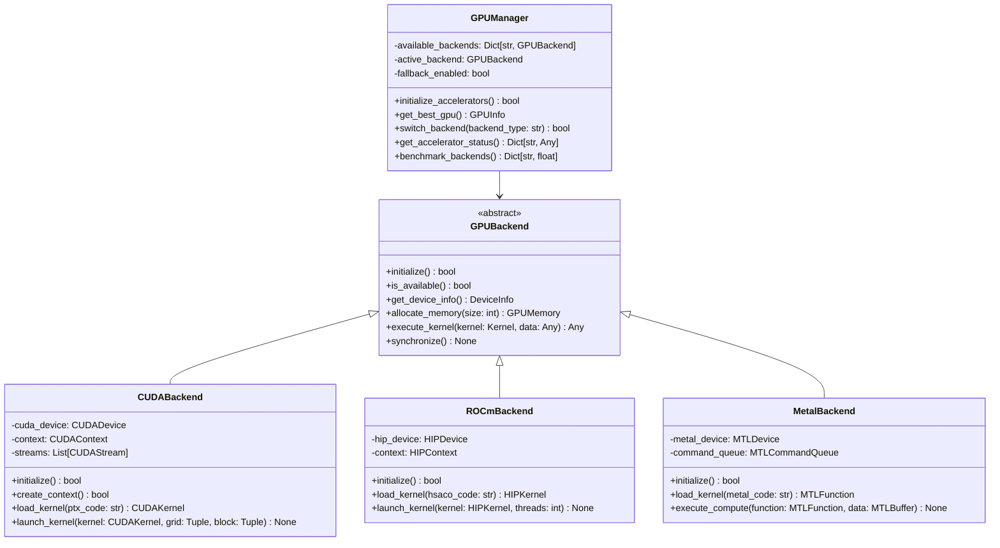
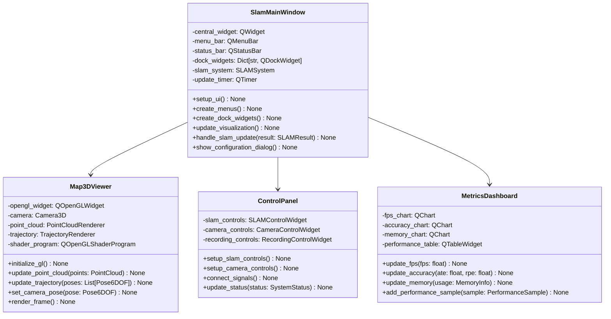
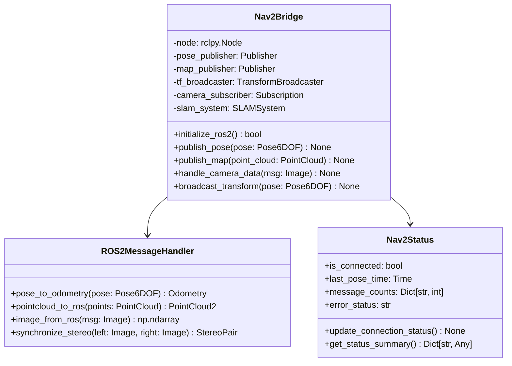

# Software Design Document (SDD)

## Python-SLAM Real-Time Visual SLAM System

**Document Number**: SDD-PYTHON-SLAM-001
**Version**: 1.0
**Date**: October 2, 2025
**Classification**: Unclassified
**Prepared by**: Python-SLAM Architecture Team
**Approved by**: [Technical Lead]

---

## Document Control

| Version | Date | Author | Description of Changes |
|---------|------|---------|----------------------|
| 1.0 | 2025-10-02 | Architecture Team | Initial design document |

---

## 1. Design Overview

### 1.1 Design Philosophy and Approach

The Python-SLAM system follows a **modular, layered architecture** with the following design principles:

- **Separation of Concerns**: Clear boundaries between SLAM processing, visualization, acceleration, and integration
- **Platform Abstraction**: Hardware and OS-specific optimizations isolated in dedicated modules
- **Performance First**: Critical path optimizations with fallback mechanisms for compatibility
- **Extensibility**: Plugin-based architecture for algorithms and hardware acceleration
- **Production Ready**: Enterprise-grade error handling, monitoring, and configuration management

### 1.2 Architecture Style

**Primary Pattern**: **Layered Architecture** with **Plugin Components**



### 1.3 Design Constraints and Assumptions

**Constraints**:

- Python 3.9+ required for type hints and performance improvements
- Real-time processing requires <100ms latency
- Memory usage must remain <512MB on desktop, <256MB on embedded
- GPU acceleration optional but recommended for performance
- Cross-platform compatibility (Linux, Windows, macOS, ARM)

**Assumptions**:

- Input cameras provide synchronized stereo or RGB-D data
- System has access to at least 4 CPU cores for parallel processing
- Graphics hardware supports OpenGL 3.3+ for visualization
- Network connectivity available for ROS2 integration (when used)

---

## 2. High-Level Design

### 2.1 System Architecture Diagrams

#### 2.1.1 System Context Diagram



#### 2.1.2 Component Architecture Diagram



### 2.2 Technology Stack Justification

| Technology | Purpose | Rationale | Alternatives Considered | Selection Criteria |
|------------|---------|-----------|-------------------------|-------------------|
| **Python 3.9+** | Core Language | • Rapid development<br>• Extensive ML/CV libraries<br>• Cross-platform compatibility<br>• Strong community support | C++, Java, Rust | Development velocity, library ecosystem, maintainability |
| **PyQt6/PySide6** | GUI Framework | • Professional desktop UI capabilities<br>• 3D visualization support<br>• Cross-platform native look<br>• OpenGL integration | Tkinter, wxPython, Kivy | Professional appearance, 3D support, platform integration |
| **OpenCV** | Computer Vision | • Industry standard CV library<br>• Optimized algorithms<br>• Hardware acceleration support<br>• Extensive feature set | PIL/Pillow, scikit-image | Performance, feature completeness, hardware optimization |
| **NumPy** | Numerical Computing | • High-performance array operations<br>• SIMD optimization<br>• Memory efficiency<br>• Ecosystem compatibility | Pure Python, JAX | Performance, ecosystem integration, stability |
| **OpenGL/VTK** | 3D Visualization | • Hardware-accelerated rendering<br>• Cross-platform graphics<br>• Scientific visualization<br>• Real-time performance | Matplotlib 3D, Three.js | Hardware acceleration, real-time performance, quality |
| **CUDA/ROCm/Metal** | GPU Acceleration | • Multi-vendor GPU support<br>• Massive parallel processing<br>• Memory bandwidth utilization<br>• Vendor optimizations | OpenCL, CPU-only | Performance, vendor support, optimization quality |
| **ROS2** | Robotics Integration | • Modern robotics standard<br>• Real-time capabilities<br>• Distributed architecture<br>• Quality of Service controls | ROS1, custom protocols | Industry adoption, real-time support, ecosystem |
| **ARM NEON** | Embedded Optimization | • Hardware SIMD acceleration<br>• Low power consumption<br>• ARM-specific optimizations<br>• Register-level control | Generic SIMD, CPU-only | Performance on target hardware, power efficiency |

### 2.3 Data Flow Diagrams

#### 2.3.1 Real-Time SLAM Processing Flow



#### 2.3.2 GPU Acceleration Data Flow



---

## 3. Low-Level Design

### 3.1 Core SLAM Engine Design

#### 3.1.1 SLAM Pipeline Class Structure



#### 3.1.2 Feature Extraction Algorithm Specifications

**ORB Feature Extraction** (REQ-F-002):

```python
# REQ-F-002: Feature Extraction and Tracking
def extract_orb_features(image: np.ndarray, max_features: int = 1000) -> Tuple[np.ndarray, np.ndarray]:
    """
    Extract ORB features from input image.

    Fulfills Requirements:
    - REQ-F-002: Feature extraction with ORB detector
    - REQ-NF-P-001: Real-time performance requirements

    Args:
        image: Input grayscale image (H, W)
        max_features: Maximum number of features to extract

    Returns:
        keypoints: Array of keypoint coordinates (N, 2)
        descriptors: Array of feature descriptors (N, 32)

    Performance:
        - Target: >500 features from 640x480 image in <10ms
        - GPU acceleration available for >3x speedup
    """
```

**SIFT Feature Extraction** (Alternative algorithm):

```python
# REQ-F-002: Feature Extraction with SIFT algorithm
def extract_sift_features(image: np.ndarray, contrast_threshold: float = 0.04) -> Tuple[np.ndarray, np.ndarray]:
    """
    Extract SIFT features with scale and rotation invariance.

    Args:
        image: Input grayscale image
        contrast_threshold: Minimum contrast for feature detection

    Returns:
        keypoints: Array of keypoint coordinates with scale and orientation
        descriptors: Array of 128-dimensional SIFT descriptors
    """
```

### 3.2 GPU Acceleration Design

#### 3.2.1 GPU Manager Architecture



#### 3.2.2 GPU Kernel Specifications

**CUDA Feature Matching Kernel** (REQ-F-007, REQ-NF-P-002):

```cuda
// REQ-F-007: GPU Acceleration Support
// REQ-NF-P-002: GPU Acceleration Performance (>3x speedup)
__global__ void feature_matching_kernel(
    const float* descriptors1,  // First descriptor set (N1 x 128)
    const float* descriptors2,  // Second descriptor set (N2 x 128)
    int* matches,              // Output matches (N1 x 2)
    float* distances,          // Output distances (N1,)
    int n1, int n2,           // Number of descriptors
    float max_distance        // Maximum matching distance
) {
    int idx = blockIdx.x * blockDim.x + threadIdx.x;
    if (idx >= n1) return;

    float best_dist = FLT_MAX;
    float second_best = FLT_MAX;
    int best_match = -1;

    // Compare with all descriptors in second set
    for (int j = 0; j < n2; j++) {
        float dist = 0.0f;

        // Compute L2 distance between descriptors
        for (int k = 0; k < 128; k++) {
            float diff = descriptors1[idx * 128 + k] - descriptors2[j * 128 + k];
            dist += diff * diff;
        }

        dist = sqrtf(dist);

        if (dist < best_dist) {
            second_best = best_dist;
            best_dist = dist;
            best_match = j;
        } else if (dist < second_best) {
            second_best = dist;
        }
    }

    // Apply ratio test and distance threshold
    if (best_dist < max_distance && best_dist / second_best < 0.8f) {
        matches[idx * 2] = idx;
        matches[idx * 2 + 1] = best_match;
        distances[idx] = best_dist;
    } else {
        matches[idx * 2] = -1;
        matches[idx * 2 + 1] = -1;
        distances[idx] = FLT_MAX;
    }
}
```

### 3.3 GUI System Design

#### 3.3.1 Main Window Architecture



#### 3.3.2 3D Visualization Specifications

**OpenGL Rendering Pipeline** (REQ-F-005, REQ-F-012):

```python
# REQ-F-005: Multi-Platform GUI Application
# REQ-F-012: Visualization and Monitoring
class PointCloudRenderer:
    """
    High-performance point cloud rendering using OpenGL.

    Fulfills Requirements:
    - REQ-F-012: Real-time 3D visualization (>20 FPS)
    - REQ-F-005: Cross-platform GUI support
    - REQ-NF-P-001: Performance requirements
    """

    def __init__(self):
        self.vertex_buffer = None
        self.color_buffer = None
        self.point_count = 0
        self.shader_program = None

    def initialize_gl(self):
        """Initialize OpenGL resources and shaders."""
        # Vertex shader for point cloud rendering
        vertex_shader_source = """
        #version 330 core
        layout (location = 0) in vec3 position;
        layout (location = 1) in vec3 color;

        uniform mat4 mvp_matrix;
        uniform float point_size;

        out vec3 vertex_color;

        void main() {
            gl_Position = mvp_matrix * vec4(position, 1.0);
            gl_PointSize = point_size;
            vertex_color = color;
        }
        """

        # Fragment shader for point rendering
        fragment_shader_source = """
        #version 330 core
        in vec3 vertex_color;
        out vec4 fragment_color;

        void main() {
            vec2 coord = gl_PointCoord - vec2(0.5);
            if (dot(coord, coord) > 0.25) discard;
            fragment_color = vec4(vertex_color, 1.0);
        }
        """
```

### 3.4 ROS2 Integration Design

#### 3.4.1 Nav2 Bridge Architecture



---

## 4. Interface Design

### 4.1 API Specifications

#### 4.1.1 Python API Interface Design

**Core SLAM API** (REQ-I-001):

```python
# REQ-I-001: Python API Interface
class PythonSLAMAPI:
    """
    Main API interface for Python-SLAM system.

    Fulfills Requirements:
    - REQ-I-001: Comprehensive Python API
    - REQ-F-010: Configuration management
    """

    def __init__(self, config_path: Optional[str] = None):
        """Initialize SLAM system with optional configuration."""

    def initialize(self) -> bool:
        """Initialize all system components."""

    def process_stereo_frame(self,
                           left_image: np.ndarray,
                           right_image: np.ndarray,
                           timestamp: float) -> SLAMResult:
        """Process stereo camera frame and return SLAM results."""

    def get_current_pose(self) -> Pose6DOF:
        """Get current camera/robot pose estimate."""

    def get_map_points(self) -> PointCloud:
        """Get current point cloud map."""

    def save_trajectory(self, filepath: str, format: str = "TUM") -> bool:
        """Save trajectory in specified format."""

    def start_recording(self, filepath: str) -> bool:
        """Start recording sensor data."""

    def stop_recording(self) -> bool:
        """Stop recording sensor data."""

    def run_benchmark(self, dataset_path: str) -> BenchmarkResults:
        """Run benchmark evaluation on dataset."""
```

#### 4.1.2 Configuration Interface Design

**Configuration Schema** (REQ-I-003):

```python
# REQ-I-003: Configuration File Interface
# REQ-F-010: Configuration Management
@dataclass
class SLAMConfig:
    """
    Complete SLAM system configuration.

    Fulfills Requirements:
    - REQ-F-010: Comprehensive configuration management
    - REQ-I-003: JSON/YAML configuration support
    """

    # Camera Configuration
    camera: CameraConfig = field(default_factory=CameraConfig)

    # Feature Extraction
    features: FeatureConfig = field(default_factory=FeatureConfig)

    # GPU Acceleration
    gpu: GPUConfig = field(default_factory=GPUConfig)

    # Performance Settings
    performance: PerformanceConfig = field(default_factory=PerformanceConfig)

    # ROS2 Integration
    ros2: ROS2Config = field(default_factory=ROS2Config)

    # Embedded Optimization
    embedded: EmbeddedConfig = field(default_factory=EmbeddedConfig)

    def validate(self) -> List[str]:
        """Validate configuration and return list of errors."""

    def save_to_file(self, filepath: str) -> bool:
        """Save configuration to JSON/YAML file."""

    @classmethod
    def load_from_file(cls, filepath: str) -> 'SLAMConfig':
        """Load configuration from JSON/YAML file."""
```

### 4.2 Message Formats

#### 4.2.1 ROS2 Message Interface (REQ-I-002)

**Pose Publishing**:

```python
# REQ-I-002: ROS2 Message Interface
def publish_pose_estimate(pose: Pose6DOF, timestamp: float) -> None:
    """
    Publish pose estimate as nav_msgs/Odometry.

    Fulfills Requirements:
    - REQ-I-002: Standard ROS2 message interfaces
    - REQ-F-008: ROS2 Nav2 integration
    """

    odometry_msg = Odometry()
    odometry_msg.header.stamp = rclpy.time.Time(seconds=timestamp).to_msg()
    odometry_msg.header.frame_id = "odom"
    odometry_msg.child_frame_id = "base_link"

    # Position
    odometry_msg.pose.pose.position.x = pose.translation[0]
    odometry_msg.pose.pose.position.y = pose.translation[1]
    odometry_msg.pose.pose.position.z = pose.translation[2]

    # Orientation (quaternion)
    odometry_msg.pose.pose.orientation.x = pose.quaternion[0]
    odometry_msg.pose.pose.orientation.y = pose.quaternion[1]
    odometry_msg.pose.pose.orientation.z = pose.quaternion[2]
    odometry_msg.pose.pose.orientation.w = pose.quaternion[3]

    # Covariance matrix (6x6)
    odometry_msg.pose.covariance = pose.covariance.flatten().tolist()
```

**Point Cloud Publishing**:

```python
# REQ-I-002: ROS2 Message Interface
def publish_point_cloud(points: PointCloud, timestamp: float) -> None:
    """
    Publish point cloud as sensor_msgs/PointCloud2.

    Fulfills Requirements:
    - REQ-I-002: PointCloud2 message publishing
    - REQ-F-003: 3D mapping and reconstruction
    """

    cloud_msg = PointCloud2()
    cloud_msg.header.stamp = rclpy.time.Time(seconds=timestamp).to_msg()
    cloud_msg.header.frame_id = "map"

    # Point cloud fields
    cloud_msg.fields = [
        PointField(name="x", offset=0, datatype=PointField.FLOAT32, count=1),
        PointField(name="y", offset=4, datatype=PointField.FLOAT32, count=1),
        PointField(name="z", offset=8, datatype=PointField.FLOAT32, count=1),
        PointField(name="rgb", offset=12, datatype=PointField.UINT32, count=1),
    ]

    cloud_msg.point_step = 16  # 4 bytes per field
    cloud_msg.row_step = cloud_msg.point_step * len(points.positions)
    cloud_msg.height = 1
    cloud_msg.width = len(points.positions)
    cloud_msg.is_dense = True

    # Pack point data
    cloud_msg.data = pack_pointcloud_data(points.positions, points.colors)
```

---

## 5. Data Structure Design

### 5.1 Core Data Types

#### 5.1.1 SLAM Data Structures

```python
# Core SLAM data types for all system components
@dataclass
class Pose6DOF:
    """6-DOF pose representation with uncertainty."""
    translation: np.ndarray  # 3D position [x, y, z]
    quaternion: np.ndarray   # Orientation [qx, qy, qz, qw]
    covariance: np.ndarray   # 6x6 uncertainty matrix
    timestamp: float         # Pose timestamp

    def to_matrix(self) -> np.ndarray:
        """Convert to 4x4 transformation matrix."""

    def inverse(self) -> 'Pose6DOF':
        """Compute inverse pose."""

@dataclass
class PointCloud:
    """3D point cloud with color information."""
    positions: np.ndarray    # Nx3 point positions
    colors: np.ndarray       # Nx3 RGB colors [0-1]
    normals: Optional[np.ndarray] = None  # Nx3 surface normals
    timestamps: Optional[np.ndarray] = None  # N timestamps

    def downsample(self, voxel_size: float) -> 'PointCloud':
        """Downsample point cloud using voxel grid."""

@dataclass
class SLAMResult:
    """Complete SLAM processing result."""
    pose: Pose6DOF
    new_map_points: PointCloud
    loop_closure_detected: bool
    processing_time: float
    feature_count: int
    tracking_quality: float
```

#### 5.1.2 Performance Monitoring Data

```python
@dataclass
class PerformanceSample:
    """Single performance measurement sample."""
    timestamp: float
    fps: float
    memory_usage_mb: float
    cpu_usage_percent: float
    gpu_usage_percent: float
    feature_count: int
    processing_time_ms: float

@dataclass
class BenchmarkResults:
    """Complete benchmark evaluation results."""
    ate_rmse: float           # Absolute Trajectory Error
    rpe_rmse: float          # Relative Pose Error
    processing_fps: float    # Average processing rate
    memory_peak_mb: float    # Peak memory usage
    success_rate: float      # Tracking success rate
    detailed_results: Dict[str, Any]  # Detailed metrics
```

---

## 6. Algorithm Specifications

### 6.1 Feature Extraction Algorithms

#### 6.1.1 ORB Feature Detection

**Algorithm Flow**:

1. **FAST Corner Detection**: Identify corner points using FAST algorithm
2. **Harris Corner Response**: Compute corner response for each FAST point
3. **Orientation Assignment**: Compute dominant orientation using intensity centroid
4. **Descriptor Computation**: Generate 256-bit binary descriptor using rotated BRIEF
5. **Feature Filtering**: Apply quality thresholds and non-maximum suppression

**Performance Characteristics**:

- **Target**: 500+ features from 640x480 image in <10ms (CPU)
- **GPU Acceleration**: 3-5x speedup with parallel processing
- **Memory Usage**: ~1MB for 1000 features with descriptors

#### 6.1.2 SIFT Feature Detection

**Algorithm Flow**:

1. **Scale-Space Construction**: Build Gaussian pyramid with octaves and scales
2. **DoG Computation**: Compute Difference of Gaussians for keypoint detection
3. **Extrema Detection**: Find local maxima/minima in DoG scale space
4. **Keypoint Refinement**: Sub-pixel localization and edge response filtering
5. **Orientation Assignment**: Compute dominant orientations from gradient histogram
6. **Descriptor Computation**: Generate 128-dimensional SIFT descriptor

**Performance Characteristics**:

- **Target**: 300+ features from 640x480 image in <50ms (CPU)
- **Memory Usage**: ~5MB for 1000 features with descriptors
- **Quality**: Superior invariance to scale, rotation, and illumination changes

### 6.2 Pose Estimation Algorithms

#### 6.2.1 PnP-based Pose Estimation

```python
def estimate_pose_pnp(object_points_3d: np.ndarray,
                     image_points_2d: np.ndarray,
                     camera_matrix: np.ndarray,
                     prev_pose: Optional[Pose6DOF] = None) -> Pose6DOF:
    """
    Estimate camera pose using Perspective-n-Point algorithm.

    Fulfills Requirements:
    - REQ-F-001: Real-time SLAM processing
    - REQ-NF-P-001: <100ms latency requirement

    Args:
        object_points_3d: 3D points in world coordinates (Nx3)
        image_points_2d: Corresponding 2D image points (Nx2)
        camera_matrix: Camera intrinsic matrix (3x3)
        prev_pose: Previous pose for initialization (optional)

    Returns:
        Estimated 6-DOF camera pose with uncertainty

    Algorithm:
        1. RANSAC outlier rejection with adaptive threshold
        2. EPnP algorithm for initial pose estimation
        3. Levenberg-Marquardt refinement
        4. Uncertainty estimation from residual analysis
    """
```

### 6.3 Loop Closure Detection

#### 6.3.1 Bag-of-Words Place Recognition

**Algorithm Components**:

1. **Visual Vocabulary**: Pre-trained vocabulary of visual words from training data
2. **Bag-of-Words Representation**: Convert image features to BoW histogram
3. **Similarity Computation**: Compute similarity using normalized dot product
4. **Temporal Consistency**: Require multiple consecutive similar frames
5. **Geometric Verification**: Verify loop closure using geometric constraints

**Performance Requirements**:

- **Detection Rate**: >95% true positive rate for actual loop closures
- **False Positive Rate**: <1% false positives to avoid mapping errors
- **Processing Time**: <100ms per frame for place recognition

---

## 7. Performance Design

### 7.1 Performance Targets

| Component | Target Performance | Measurement Method |
|-----------|-------------------|-------------------|
| Feature Extraction | 500+ features in <10ms | Timing benchmarks |
| Pose Estimation | <20ms per frame | Real-time profiling |
| Point Cloud Update | 1000+ points in <5ms | Memory and timing |
| GUI Rendering | >20 FPS for 3D visualization | Frame rate monitoring |
| GPU Acceleration | >3x speedup vs CPU | Comparative benchmarks |
| Memory Usage | <512MB desktop, <256MB embedded | Memory profiling |

### 7.2 Optimization Strategies

#### 7.2.1 CPU Optimizations

1. **SIMD Vectorization**: Use NumPy vectorized operations and explicit SIMD
2. **Memory Layout**: Optimize data structures for cache efficiency
3. **Parallel Processing**: Multi-threading for independent operations
4. **Algorithmic Optimization**: Choose algorithms based on performance characteristics

#### 7.2.2 GPU Optimizations

1. **Memory Coalescing**: Ensure efficient GPU memory access patterns
2. **Occupancy Optimization**: Maximize GPU core utilization
3. **Memory Management**: Minimize GPU-CPU memory transfers
4. **Kernel Fusion**: Combine operations to reduce kernel launch overhead

#### 7.2.3 Embedded Optimizations

1. **ARM NEON SIMD**: Use ARM-specific SIMD instructions
2. **Fixed-Point Arithmetic**: Replace floating-point with fixed-point where possible
3. **Power Management**: Adaptive quality settings based on thermal/power constraints
4. **Memory Optimization**: Minimize memory allocations and fragmentation

---

## 8. Security and Safety Design

### 8.1 Input Validation

**Image Data Validation** (REQ-NF-S-001):

```python
def validate_image_input(image: np.ndarray) -> bool:
    """
    Validate input image data for security and safety.

    Fulfills Requirements:
    - REQ-NF-S-001: Input validation for security
    - REQ-NF-R-002: Data integrity assurance
    """

    # Check image dimensions
    if len(image.shape) not in [2, 3]:
        raise ValueError("Invalid image dimensions")

    # Check image size limits
    max_pixels = 10_000_000  # 10MP limit
    if image.size > max_pixels:
        raise ValueError("Image too large")

    # Check data type
    if image.dtype not in [np.uint8, np.uint16, np.float32]:
        raise ValueError("Unsupported image data type")

    # Check for valid pixel values
    if image.dtype == np.uint8:
        if not (0 <= image.min() and image.max() <= 255):
            raise ValueError("Invalid pixel values for uint8")

    return True
```

### 8.2 Error Handling Strategy

**Graceful Degradation** (REQ-NF-R-003):

1. **Feature Extraction Failure**: Fall back to simpler feature detector
2. **GPU Unavailable**: Automatic fallback to CPU processing
3. **Tracking Loss**: Re-initialization with expanded search window
4. **Memory Pressure**: Adaptive quality reduction and cleanup
5. **Network Failure**: Continue operation without ROS2 publishing

---

**Document End**

*This Software Design Document is maintained as part of the Python-SLAM configuration management system. All design changes must be approved through the established change control process.*
