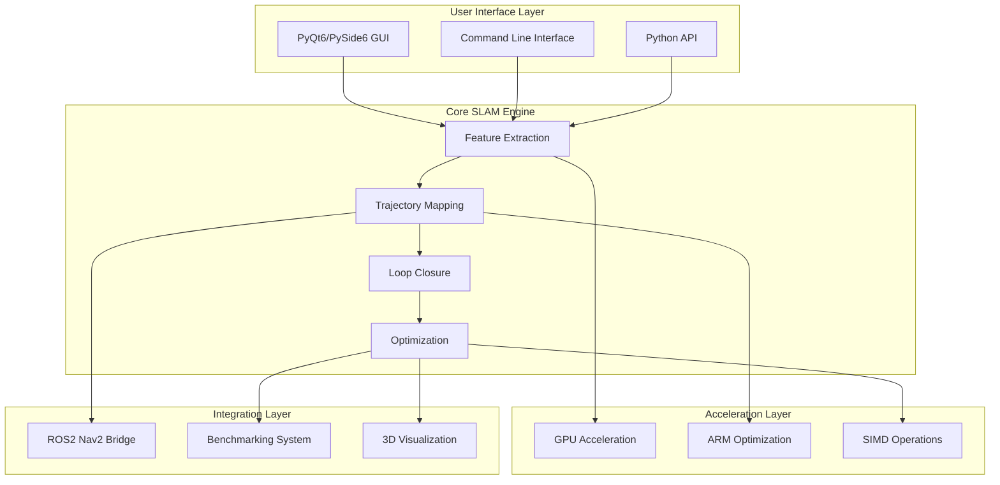

# Software Requirements Document (SRD)
## Python-SLAM Real-Time Visual SLAM System

**Document Number**: SRD-PYTHON-SLAM-001
**Version**: 1.0
**Date**: October 2, 2025
**Classification**: Unclassified
**Prepared by**: Python-SLAM Development Team
**Approved by**: [Project Manager]

---

## Document Control

| Version | Date | Author | Description of Changes |
|---------|------|---------|----------------------|
| 1.0 | 2025-10-02 | Development Team | Initial requirements document |

---

## 1. Introduction

### 1.1 Purpose

This Software Requirements Document (SRD) specifies the functional and non-functional requirements for the Python-SLAM system, a comprehensive real-time Visual Simultaneous Localization and Mapping (SLAM) platform. The system addresses the critical need for accurate, real-time spatial understanding in robotics, autonomous vehicles, augmented reality, and embedded systems applications.

**Problem Statement**: Current SLAM solutions suffer from:
- Limited cross-platform compatibility
- Inadequate real-time performance on embedded systems
- Poor integration with modern robotics frameworks (ROS2)
- Lack of comprehensive benchmarking and evaluation tools
- Insufficient GPU acceleration support across different vendors

**Solution**: Python-SLAM provides a unified, high-performance SLAM platform with comprehensive tooling, multi-platform support, and production-ready interfaces.

### 1.2 Scope

**System Boundaries**:
- **IN SCOPE**: Real-time SLAM processing, 3D visualization, benchmarking, GPU acceleration, ROS2 integration, embedded optimization
- **OUT OF SCOPE**: Hardware driver development, custom sensor protocols, cloud processing services, commercial licensing management

**Target Platforms**: Linux (primary), Windows, macOS, ARM embedded systems (Raspberry Pi, NVIDIA Jetson)

### 1.3 Document Overview

This document follows NASA-STD-8739.8 structure with requirements categorized as:
- **Functional Requirements (REQ-F-XXX)**: Core system capabilities
- **Non-Functional Requirements (REQ-NF-XXX)**: Performance, reliability, security
- **Interface Requirements (REQ-I-XXX)**: External system interactions

### 1.4 Applicable Documents

| Document | Title | Version |
|----------|-------|---------|
| NASA-STD-8739.8 | Software Assurance Standard | Rev A |
| NASA-STD-2100-91 | Software Documentation Standard | Rev B |
| IEEE 830-1998 | Software Requirements Specifications | 1998 |

---

## 2. System Overview

### 2.1 System Architecture Overview

The Python-SLAM system implements a modular architecture with the following major subsystems:

### 2.2 Technology Stack Rationale

| Component | Technology | Version | Rationale |
|-----------|------------|---------|-----------|
| Core Language | Python | 3.9+ | Rapid development, extensive ML libraries, cross-platform |
| GUI Framework | PyQt6/PySide6 | 6.0+ | Professional UI capabilities, 3D visualization support |
| GPU Acceleration | CUDA/ROCm/Metal | Latest | Multi-vendor GPU support for maximum compatibility |
| 3D Graphics | OpenGL/VTK | 4.0+/9.0+ | Industry-standard 3D rendering capabilities |
| Robotics Integration | ROS2 | Humble+ | Modern robotics framework with real-time capabilities |
| Embedded Optimization | ARM NEON | Native | Hardware-specific acceleration for embedded platforms |

### 2.3 Performance Objectives

| Metric | Target | Measurement |
|--------|--------|-------------|
| Frame Processing Rate | ≥30 FPS | Real-time image processing |
| Localization Accuracy | <1cm RMS | Against ground truth datasets |
| Memory Usage | <512MB | Typical operation footprint |
| Startup Time | <5 seconds | GUI application launch |
| GPU Utilization | >80% | During intensive operations |

---

## 3. Functional Requirements

### REQ-F-001: Real-Time SLAM Processing
**Priority**: High
**Rationale**: Core functionality - system must process sensor data in real-time for practical applications
**Source**: Primary user need for real-time spatial awareness
**Verification Method**: Test

**Description**:
The system shall process stereo camera input at minimum 30 FPS with complete SLAM pipeline including feature extraction, tracking, mapping, and localization.

**Acceptance Criteria**:
1. Process 640x480 stereo images at ≥30 FPS on modern hardware
2. Maintain <100ms latency from input to pose output
3. Generate accurate 6-DOF pose estimates with <1cm translation error

**Dependencies**: REQ-F-002, REQ-NF-P-001
**Risk Level**: High
**Allocated to**: Core SLAM Engine

### REQ-F-002: Feature Extraction and Tracking
**Priority**: High
**Rationale**: Fundamental SLAM capability - accurate features enable robust tracking
**Source**: SLAM algorithm requirements
**Verification Method**: Test

**Description**:
The system shall extract and track visual features across image frames using configurable feature detectors (ORB, SIFT, SURF).

**Acceptance Criteria**:
1. Extract minimum 500 features per frame from 640x480 images
2. Track features across minimum 10 consecutive frames
3. Support multiple feature detector algorithms with runtime switching

**Dependencies**: REQ-F-001, REQ-F-010
**Risk Level**: Medium
**Allocated to**: Feature Extraction Module

### REQ-F-003: 3D Mapping and Reconstruction
**Priority**: High
**Rationale**: Essential for spatial understanding and navigation
**Source**: User requirement for environmental mapping
**Verification Method**: Test/Analysis

**Description**:
The system shall generate dense 3D point cloud maps from stereo vision input with real-time visualization capabilities.

**Acceptance Criteria**:
1. Generate point clouds with >1000 points per frame
2. Maintain map consistency across sessions
3. Support map saving/loading in standard formats (PLY, PCD)

**Dependencies**: REQ-F-001, REQ-F-012
**Risk Level**: Medium
**Allocated to**: Mapping Module, Visualization System

### REQ-F-004: Loop Closure Detection
**Priority**: High
**Rationale**: Critical for long-term accuracy and drift correction
**Source**: SLAM accuracy requirements
**Verification Method**: Test

**Description**:
The system shall detect when the robot/camera returns to previously visited locations and perform loop closure optimization.

**Acceptance Criteria**:
1. Detect loop closures with >95% accuracy
2. Perform optimization within 2 seconds of detection
3. Reduce accumulated drift by >80% after loop closure

**Dependencies**: REQ-F-002, REQ-F-003
**Risk Level**: High
**Allocated to**: Loop Closure Module

### REQ-F-005: Multi-Platform GUI Application
**Priority**: High
**Rationale**: User accessibility and system monitoring requirements
**Source**: User interface requirements
**Verification Method**: Demonstration

**Description**:
The system shall provide a comprehensive graphical user interface supporting real-time visualization, configuration, and monitoring.

**Acceptance Criteria**:
1. Support Windows, macOS, and Linux platforms
2. Display real-time 3D map visualization at >20 FPS
3. Provide configuration panels for all SLAM parameters

**Dependencies**: REQ-F-003, REQ-I-001
**Risk Level**: Medium
**Allocated to**: GUI System

### REQ-F-006: Benchmarking and Evaluation
**Priority**: Medium
**Rationale**: Performance validation and comparison with other SLAM systems
**Source**: Development and research requirements
**Verification Method**: Test

**Description**:
The system shall provide comprehensive benchmarking capabilities with standard SLAM evaluation metrics.

**Acceptance Criteria**:
1. Calculate Absolute Trajectory Error (ATE) and Relative Pose Error (RPE)
2. Support standard datasets (TUM, KITTI, EuRoC)
3. Generate detailed performance reports with visualizations

**Dependencies**: REQ-F-001, REQ-F-015
**Risk Level**: Low
**Allocated to**: Benchmarking System

### REQ-F-007: GPU Acceleration Support
**Priority**: High
**Rationale**: Performance requirements for real-time operation
**Source**: Performance and efficiency requirements
**Verification Method**: Test

**Description**:
The system shall support GPU acceleration for computationally intensive SLAM operations across multiple GPU vendors.

**Acceptance Criteria**:
1. Support NVIDIA (CUDA), AMD (ROCm), and Apple (Metal) GPUs
2. Achieve >3x speedup for feature extraction on GPU vs CPU
3. Automatic fallback to CPU when GPU unavailable

**Dependencies**: REQ-F-002, REQ-NF-P-002
**Risk Level**: Medium
**Allocated to**: GPU Acceleration Module

### REQ-F-008: ROS2 Integration
**Priority**: Medium
**Rationale**: Integration with modern robotics systems
**Source**: Robotics application requirements
**Verification Method**: Test

**Description**:
The system shall integrate with ROS2 Nav2 stack for robotics applications with standard message interfaces.

**Acceptance Criteria**:
1. Publish pose estimates as nav_msgs/Odometry
2. Publish point cloud maps as sensor_msgs/PointCloud2
3. Subscribe to camera topics with automatic synchronization

**Dependencies**: REQ-F-001, REQ-I-002
**Risk Level**: Medium
**Allocated to**: ROS2 Integration Module

### REQ-F-009: Embedded System Optimization
**Priority**: Medium
**Rationale**: Support for resource-constrained embedded platforms
**Source**: Embedded application requirements
**Verification Method**: Test

**Description**:
The system shall operate efficiently on ARM-based embedded systems with hardware-specific optimizations.

**Acceptance Criteria**:
1. Run on Raspberry Pi 4 with >15 FPS processing
2. Utilize ARM NEON SIMD instructions for acceleration
3. Adaptive quality settings based on available resources

**Dependencies**: REQ-F-001, REQ-NF-P-003
**Risk Level**: Medium
**Allocated to**: Embedded Optimization Module

### REQ-F-010: Configuration Management
**Priority**: Medium
**Rationale**: System adaptability and user customization
**Source**: Operational flexibility requirements
**Verification Method**: Inspection

**Description**:
The system shall provide comprehensive configuration management with persistent settings and runtime parameter adjustment.

**Acceptance Criteria**:
1. Support JSON/YAML configuration files
2. Allow runtime parameter modification through GUI/API
3. Validate configuration parameters with error reporting

**Dependencies**: REQ-F-005, REQ-I-003
**Risk Level**: Low
**Allocated to**: Configuration System

---

## 4. Non-Functional Requirements

### 4.1 Performance Requirements

### REQ-NF-P-001: Real-Time Processing Performance
**Priority**: High
**Rationale**: Real-time applications require consistent, predictable performance
**Source**: System performance objectives
**Verification Method**: Test

**Description**:
The system shall maintain real-time performance under specified operational conditions.

**Acceptance Criteria**:
1. Process 640x480 stereo images at ≥30 FPS on Intel i7-8th gen or equivalent
2. Maintain <100ms end-to-end latency from image capture to pose output
3. Handle frame drops gracefully without system crash

**Dependencies**: REQ-F-001, REQ-F-007
**Risk Level**: High
**Allocated to**: Core SLAM Engine

### REQ-NF-P-002: GPU Acceleration Performance
**Priority**: High
**Rationale**: GPU acceleration essential for meeting performance targets
**Source**: Performance optimization requirements
**Verification Method**: Test

**Description**:
The system shall achieve significant performance improvements when GPU acceleration is available.

**Acceptance Criteria**:
1. Feature extraction >3x faster on GPU vs CPU
2. Point cloud processing >5x faster on GPU vs CPU
3. GPU memory usage <4GB for typical operations

**Dependencies**: REQ-F-007
**Risk Level**: Medium
**Allocated to**: GPU Acceleration Module

### 4.2 Reliability Requirements

### REQ-NF-R-001: System Stability
**Priority**: High
**Rationale**: System must operate reliably for extended periods
**Source**: Operational reliability requirements
**Verification Method**: Test

**Description**:
The system shall operate continuously without failure under normal conditions.

**Acceptance Criteria**:
1. Mean Time Between Failures (MTBF) >24 hours continuous operation
2. Graceful degradation when individual components fail
3. Automatic recovery from temporary failures

**Dependencies**: All functional requirements
**Risk Level**: High
**Allocated to**: System Architecture

---

## 5. Interface Requirements

### REQ-I-001: Python API Interface
**Priority**: High
**Rationale**: Programmatic access for integration and automation
**Source**: Developer integration requirements
**Verification Method**: Test

**Description**:
The system shall provide a comprehensive Python API for programmatic access to all major functions.

**Acceptance Criteria**:
1. Object-oriented API with clear class hierarchies
2. Complete coverage of GUI functionality through API
3. API documentation with examples and type annotations

**Dependencies**: All functional requirements
**Risk Level**: Low
**Allocated to**: API Layer

### REQ-I-002: ROS2 Message Interface
**Priority**: Medium
**Rationale**: Integration with ROS2 robotics ecosystem
**Source**: Robotics integration requirements
**Verification Method**: Test

**Description**:
The system shall implement standard ROS2 message interfaces for robotics integration.

**Acceptance Criteria**:
1. Publish nav_msgs/Odometry for pose estimates
2. Publish sensor_msgs/PointCloud2 for map data
3. Subscribe to sensor_msgs/Image for camera input

**Dependencies**: REQ-F-008
**Risk Level**: Medium
**Allocated to**: ROS2 Integration Module

---

## 6. Requirements Traceability

### 6.1 High-Level Requirement Mapping

| System Goal | Related Requirements |
|-------------|---------------------|
| Real-time SLAM | REQ-F-001, REQ-F-002, REQ-F-004, REQ-NF-P-001 |
| Cross-platform Support | REQ-F-005, REQ-I-001 |
| Performance Optimization | REQ-F-007, REQ-F-009, REQ-NF-P-002 |
| Robotics Integration | REQ-F-008, REQ-I-002 |

---

**Document End**

*This document is controlled under the Python-SLAM configuration management system. All changes must be approved through the established change control process.*
