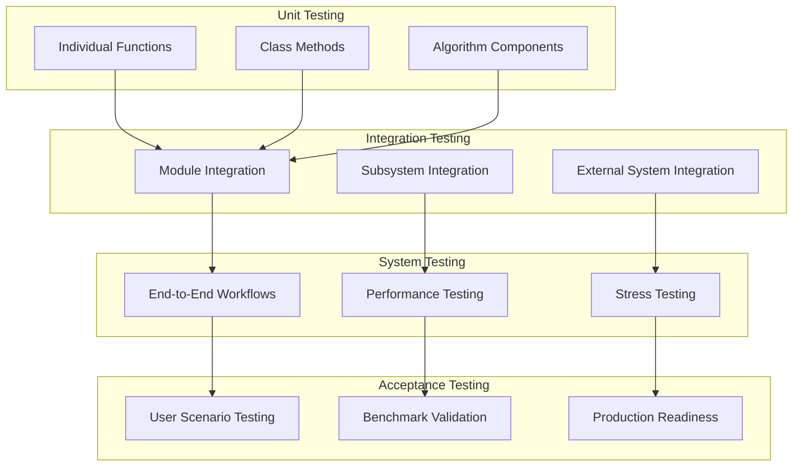

# Software Test Plan (STP)

## Python-SLAM Real-Time Visual SLAM System

**Document Number**: STP-PYTHON-SLAM-001
**Version**: 1.0
**Date**: October 2, 2025
**Classification**: Unclassified
**Prepared by**: Python-SLAM Test Team
**Approved by**: [Test Manager]

---

## Document Control

| Version | Date | Author | Description of Changes |
|---------|------|---------|----------------------|
| 1.0 | 2025-10-02 | Test Team | Initial test plan |

---

## 1. Introduction

### 1.1 Purpose

This Software Test Plan (STP) defines the comprehensive testing strategy, approach, and procedures for the Python-SLAM real-time visual SLAM system. The plan ensures thorough verification of all functional and non-functional requirements while maintaining traceability to the Software Requirements Document (SRD).

### 1.2 Scope

**Testing Scope**:

- **Functional Testing**: All SLAM core functions, GUI components, and integrations
- **Performance Testing**: Real-time processing, GPU acceleration, embedded optimization
- **Integration Testing**: ROS2 integration, multi-component interactions
- **System Testing**: End-to-end SLAM workflows and user scenarios
- **Regression Testing**: Automated test suite for continuous integration

**Out of Scope**:

- Hardware driver testing (assumes working camera hardware)
- Operating system testing (relies on platform APIs)
- Third-party library testing (OpenCV, PyQt, etc.)

### 1.3 Test Objectives

| Objective | Success Criteria | Priority |
|-----------|------------------|----------|
| Functional Verification | 100% requirements coverage, all tests pass | High |
| Performance Validation | Meet all performance targets (30 FPS, <100ms latency) | High |
| Integration Verification | All interfaces work correctly with external systems | High |
| Reliability Validation | 24+ hour continuous operation without failure | Medium |
| Usability Verification | User tasks completed within time/error limits | Medium |

---

## 2. Test Strategy and Approach

### 2.1 Testing Levels



### 2.2 Test Types and Methods

| Test Type | Method | Coverage | Automation Level |
|-----------|--------|----------|------------------|
| **Unit Tests** | White-box testing of individual functions | 90%+ code coverage | Fully automated |
| **Integration Tests** | Black-box testing of component interfaces | All interface contracts | Fully automated |
| **Performance Tests** | Timing and resource measurement | All performance requirements | Semi-automated |
| **System Tests** | End-to-end scenario testing | All user workflows | Semi-automated |
| **Regression Tests** | Automated test suite execution | Changed/affected code | Fully automated |
| **Stress Tests** | Resource exhaustion and edge cases | System limits and failure modes | Manual/automated |
| **Usability Tests** | User task completion and satisfaction | GUI and API usability | Manual |

### 2.3 Test Environment Strategy

#### 2.3.1 Test Environment Matrix

| Environment | Purpose | Hardware | OS | Automation |
|-------------|---------|----------|----|-----------|
| **Development** | Unit/Integration testing | Developer workstations | Linux/Windows/macOS | CI/CD |
| **Performance** | Performance/stress testing | High-end desktop (i7, 32GB, RTX 4070) | Linux | Semi-automated |
| **Embedded** | Embedded optimization testing | Raspberry Pi 4, Jetson Nano | Linux ARM | Manual |
| **Integration** | ROS2/external system testing | Multi-node setup | Ubuntu 22.04 | Automated |
| **Production** | Final validation testing | Target deployment hardware | Production OS | Manual |

#### 2.3.2 Test Data Management

**Synthetic Test Data**:

- Generated stereo image sequences with known ground truth
- Controlled lighting and motion patterns
- Configurable noise and distortion parameters

**Real Dataset Integration**:

- TUM RGB-D Dataset for indoor SLAM evaluation
- KITTI Dataset for outdoor automotive scenarios
- EuRoC MAV Dataset for aerial vehicle SLAM
- Custom recorded sequences for specific test cases

---

## 3. Test Cases and Requirements Mapping

### 3.1 Functional Requirements Testing

#### 3.1.1 REQ-F-001: Real-Time SLAM Processing

**Test Case TC-F-001-01: Basic SLAM Pipeline Processing**

- **Objective**: Verify SLAM pipeline processes stereo input at 30+ FPS
- **Prerequisites**: Calibrated stereo camera, test image sequence
- **Test Steps**:
  1. Initialize SLAM system with default configuration
  2. Feed stereo image sequence at 30 FPS
  3. Monitor processing frame rate and latency
  4. Verify pose estimates are generated for each frame
- **Expected Results**:
  - Frame rate ≥30 FPS achieved
  - Latency <100ms per frame
  - Valid pose estimates for >95% of frames
- **Pass Criteria**: All expected results met
- **Requirements Verified**: REQ-F-001, REQ-NF-P-001

**Test Case TC-F-001-02: SLAM Accuracy Validation**

- **Objective**: Verify SLAM accuracy meets specification (<1cm RMS)
- **Prerequisites**: TUM dataset with ground truth trajectory
- **Test Steps**:
  1. Process complete TUM sequence through SLAM pipeline
  2. Compare estimated trajectory with ground truth
  3. Calculate Absolute Trajectory Error (ATE)
  4. Calculate Relative Pose Error (RPE)
- **Expected Results**:
  - ATE RMSE <1cm for standard sequences
  - RPE translation error <1% of traveled distance
  - No catastrophic tracking failures
- **Pass Criteria**: Accuracy targets met for 80% of test sequences
- **Requirements Verified**: REQ-F-001, REQ-F-006

#### 3.1.2 REQ-F-002: Feature Extraction and Tracking

**Test Case TC-F-002-01: ORB Feature Extraction Performance**

- **Objective**: Verify ORB extracts 500+ features from 640x480 images
- **Prerequisites**: Standard test image set (indoor/outdoor/varying lighting)
- **Test Steps**:
  1. Configure SLAM for ORB feature detection
  2. Process test images through feature extraction
  3. Count extracted features per image
  4. Measure extraction time
- **Expected Results**:
  - 500+ features extracted from well-textured images
  - <10ms processing time per image
  - Consistent detection across lighting conditions
- **Pass Criteria**: Feature count and timing targets met for 90% of test images
- **Requirements Verified**: REQ-F-002

**Test Case TC-F-002-02: Multi-Algorithm Feature Support**

- **Objective**: Verify runtime switching between ORB, SIFT, SURF detectors
- **Prerequisites**: Test images, algorithm implementations
- **Test Steps**:
  1. Initialize with ORB detector
  2. Process several frames
  3. Switch to SIFT detector during processing
  4. Switch to SURF detector
  5. Verify tracking continuity across switches
- **Expected Results**:
  - Successful algorithm switching without crashes
  - Tracking maintained across algorithm changes
  - Performance characteristics as expected per algorithm
- **Pass Criteria**: All algorithm switches successful, tracking maintained
- **Requirements Verified**: REQ-F-002

#### 3.1.3 REQ-F-007: GPU Acceleration Support

**Test Case TC-F-007-01: Multi-Vendor GPU Detection**

- **Objective**: Verify system detects and utilizes NVIDIA, AMD, Apple GPUs
- **Prerequisites**: Test systems with different GPU vendors
- **Test Steps**:
  1. Run GPU detection on NVIDIA system (CUDA)
  2. Run GPU detection on AMD system (ROCm)
  3. Run GPU detection on Apple system (Metal)
  4. Verify automatic backend selection
- **Expected Results**:
  - Correct GPU vendor detection
  - Appropriate backend initialization
  - Fallback to CPU when GPU unavailable
- **Pass Criteria**: Correct detection and initialization on all tested platforms
- **Requirements Verified**: REQ-F-007

**Test Case TC-F-007-02: GPU Acceleration Performance**

- **Objective**: Verify >3x speedup for feature extraction on GPU vs CPU
- **Prerequisites**: System with compatible GPU, benchmarking tools
- **Test Steps**:
  1. Benchmark feature extraction on CPU-only mode
  2. Benchmark feature extraction with GPU acceleration
  3. Compare processing times
  4. Verify result consistency between CPU and GPU
- **Expected Results**:
  - GPU processing >3x faster than CPU
  - Identical or equivalent results from both methods
  - GPU memory usage <4GB during operation
- **Pass Criteria**: Performance improvement targets met, results consistent
- **Requirements Verified**: REQ-F-007, REQ-NF-P-002

### 3.2 Non-Functional Requirements Testing

#### 3.2.1 REQ-NF-P-001: Real-Time Processing Performance

**Test Case TC-NF-P-001-01: Sustained Performance Testing**

- **Objective**: Verify sustained 30 FPS performance over extended operation
- **Prerequisites**: Long test sequence (30+ minutes), performance monitoring
- **Test Steps**:
  1. Initialize SLAM with performance monitoring enabled
  2. Process continuous stereo feed for 30 minutes
  3. Monitor frame rate, latency, and resource usage
  4. Record performance degradation over time
- **Expected Results**:
  - Average frame rate ≥30 FPS throughout test
  - 95th percentile latency <150ms
  - No significant performance degradation over time
- **Pass Criteria**: Performance targets maintained for duration of test
- **Requirements Verified**: REQ-NF-P-001

#### 3.2.2 REQ-NF-R-001: System Stability

**Test Case TC-NF-R-001-01: 24-Hour Stability Testing**

- **Objective**: Verify system operates continuously for 24+ hours without failure
- **Prerequisites**: Automated test harness, continuous data feed
- **Test Steps**:
  1. Start SLAM system with automated monitoring
  2. Feed continuous synthetic or recorded data
  3. Monitor for crashes, memory leaks, performance degradation
  4. Log all errors and performance metrics
- **Expected Results**:
  - No system crashes or unrecoverable errors
  - Memory usage remains stable (no leaks)
  - Performance maintains within acceptable bounds
- **Pass Criteria**: System completes 24-hour test without failure
- **Requirements Verified**: REQ-NF-R-001

### 3.3 Integration Requirements Testing

#### 3.3.1 REQ-I-002: ROS2 Message Interface

**Test Case TC-I-002-01: ROS2 Message Publishing**

- **Objective**: Verify correct ROS2 message publishing for poses and maps
- **Prerequisites**: ROS2 environment, test subscribers
- **Test Steps**:
  1. Initialize ROS2 integration
  2. Start SLAM processing
  3. Monitor published nav_msgs/Odometry messages
  4. Monitor published sensor_msgs/PointCloud2 messages
  5. Verify message format and frequency
- **Expected Results**:
  - Odometry messages published at processing frame rate
  - Point cloud messages published at configured rate
  - All message fields correctly populated
  - Valid timestamps and coordinate frames
- **Pass Criteria**: All message types published correctly with valid data
- **Requirements Verified**: REQ-I-002, REQ-F-008

---

## 4. Performance Testing

### 4.1 Performance Test Scenarios

#### 4.1.1 Baseline Performance Testing

**Scenario**: Standard indoor office environment with good lighting

| Metric | Target | Measurement Method |
|--------|--------|--------------------|
| Processing FPS | ≥30 FPS | Frame timing analysis |
| End-to-end Latency | <100ms | Timestamp comparison |
| Memory Usage | <512MB | Process monitoring |
| CPU Usage | <80% average | System resource monitoring |
| GPU Utilization | >80% when available | GPU monitoring tools |

#### 4.1.2 Stress Testing Scenarios

**High Feature Density**:

- Test environment: Highly textured scene with 2000+ detectable features
- Expected behavior: System maintains frame rate through feature filtering

**Low Light Conditions**:

- Test environment: Dimly lit scene with minimal features
- Expected behavior: Graceful degradation with increased tracking robustness

**Rapid Motion**:

- Test environment: Fast camera motion with motion blur
- Expected behavior: Robust tracking with predictive pose estimation

**Memory Pressure**:

- Test scenario: Limited memory environment (2GB total)
- Expected behavior: Adaptive quality reduction and memory cleanup

### 4.2 Embedded System Performance

#### 4.2.1 Raspberry Pi 4 Testing

**Hardware Configuration**:

- Raspberry Pi 4 Model B (8GB RAM)
- ARM Cortex-A72 quad-core 1.5GHz
- microSD card storage
- USB 3.0 stereo camera

**Performance Targets**:

| Metric | Target | Acceptable |
|--------|--------|------------|
| Processing FPS | ≥15 FPS | ≥10 FPS |
| Memory Usage | <1GB | <1.5GB |
| CPU Usage | <80% | <90% |
| Power Consumption | <5W | <7W |

#### 4.2.2 NVIDIA Jetson Testing

**Hardware Configuration**:

- NVIDIA Jetson Nano/Xavier
- ARM Cortex-A57/A78AE
- Integrated GPU
- CSI camera interface

**Performance Targets**:

| Metric | Target | Acceptable |
|--------|--------|------------|
| Processing FPS | ≥30 FPS | ≥20 FPS |
| GPU Utilization | >70% | >50% |
| Memory Usage | <2GB | <3GB |
| Power Efficiency | >10 FPS/W | >5 FPS/W |

---

## 5. Test Environment Requirements

### 5.1 Hardware Requirements

#### 5.1.1 Development Testing Environment

**Minimum Configuration**:

- CPU: Intel Core i5-8th gen or AMD Ryzen 5 3600
- RAM: 16GB DDR4
- Storage: 500GB SSD
- GPU: GTX 1660 or equivalent (optional)
- Cameras: USB 3.0 stereo camera or individual calibrated cameras

**Recommended Configuration**:

- CPU: Intel Core i7-10th gen or AMD Ryzen 7 5700X
- RAM: 32GB DDR4
- Storage: 1TB NVMe SSD
- GPU: RTX 4070 or equivalent
- Cameras: High-quality stereo camera with hardware synchronization

#### 5.1.2 Performance Testing Environment

**High-End Configuration**:

- CPU: Intel Core i9-12900K or AMD Ryzen 9 5900X
- RAM: 64GB DDR4-3200
- Storage: 2TB NVMe SSD
- GPU: RTX 4080 or RX 7800 XT
- Cameras: Industrial stereo camera system

### 5.2 Software Requirements

#### 5.2.1 Operating System Support

| Platform | Versions | Test Priority |
|----------|----------|---------------|
| Ubuntu Linux | 20.04 LTS, 22.04 LTS | Primary |
| Windows | 10, 11 | Secondary |
| macOS | 12+, Apple Silicon support | Tertiary |
| Raspberry Pi OS | 64-bit, latest | Embedded |

#### 5.2.2 Development Tools

**Required Tools**:

- Python 3.9+ with pip and virtual environment support
- Git version control
- CMake 3.16+ for native extensions
- OpenCV 4.5+ with Python bindings
- PyQt6/PySide6 for GUI testing

**Testing Tools**:

- pytest for unit testing
- pytest-benchmark for performance testing
- pytest-cov for coverage analysis
- memory_profiler for memory analysis
- ROS2 tools for integration testing

---

## 6. Test Execution

### 6.1 Test Execution Schedule

#### 6.1.1 Development Testing (Continuous)

**Daily Execution**:

- Unit tests (all modules)
- Basic integration tests
- Performance regression tests
- Code coverage analysis

**Weekly Execution**:

- Complete integration test suite
- GUI functional tests
- Embedded platform tests
- Memory and resource leak tests

#### 6.1.2 Release Testing (Per Release Cycle)

**Pre-Release Testing** (2 weeks before release):

- Complete functional test suite
- Performance benchmarking
- Multi-platform compatibility testing
- Stress testing and reliability validation

**Release Candidate Testing** (1 week before release):

- User acceptance testing
- Final performance validation
- Documentation and example verification
- Production environment testing

### 6.2 Test Automation

#### 6.2.1 Continuous Integration Pipeline

```yaml
# GitHub Actions CI/CD Pipeline
name: Python-SLAM Test Suite

on: [push, pull_request]

jobs:
  unit-tests:
    runs-on: [ubuntu-latest, windows-latest, macos-latest]
    steps:
      - uses: actions/checkout@v3
      - name: Setup Python
        uses: actions/setup-python@v4
        with:
          python-version: '3.9'
      - name: Install dependencies
        run: pip install -r requirements-test.txt
      - name: Run unit tests
        run: python -m pytest tests/unit/ -v --cov

  integration-tests:
    runs-on: ubuntu-latest
    steps:
      - uses: actions/checkout@v3
      - name: Setup test environment
        run: ./scripts/setup-test-env.sh
      - name: Run integration tests
        run: python -m pytest tests/integration/ -v

  performance-tests:
    runs-on: ubuntu-latest
    steps:
      - uses: actions/checkout@v3
      - name: Setup performance testing
        run: ./scripts/setup-perf-test.sh
      - name: Run performance benchmarks
        run: python -m pytest tests/performance/ --benchmark-only
```

#### 6.2.2 Automated Test Reporting

**Test Metrics Collection**:

- Test execution time and results
- Code coverage percentage
- Performance benchmark results
- Memory usage and leak detection
- Platform-specific test results

**Reporting Dashboard**:

- Real-time test status display
- Historical trend analysis
- Performance regression alerts
- Coverage trend monitoring
- Failure rate tracking

---

## 7. Acceptance Criteria

### 7.1 Functional Acceptance

| Requirement Category | Acceptance Threshold | Measurement |
|---------------------|---------------------|-------------|
| Core SLAM Functions | 100% requirements verified | All functional tests pass |
| GUI Components | 100% core features working | All GUI tests pass |
| Integration Points | All interfaces validated | Integration tests pass |
| Configuration | All options functional | Configuration tests pass |

### 7.2 Performance Acceptance

| Performance Metric | Target | Minimum Acceptable |
|-------------------|--------|-------------------|
| Real-time Processing | 30 FPS | 25 FPS |
| Processing Latency | <100ms | <150ms |
| Memory Usage (Desktop) | <512MB | <768MB |
| Memory Usage (Embedded) | <256MB | <384MB |
| GPU Acceleration Speedup | >3x | >2x |
| Startup Time | <5 seconds | <10 seconds |

### 7.3 Reliability Acceptance

| Reliability Metric | Target | Minimum Acceptable |
|-------------------|--------|-------------------|
| Continuous Operation | 24+ hours | 12+ hours |
| Mean Time Between Failures | >24 hours | >12 hours |
| Recovery Time from Failure | <30 seconds | <60 seconds |
| Memory Leak Rate | 0 MB/hour | <1 MB/hour |

---

## 8. Risk Assessment and Mitigation

### 8.1 Test Risks

| Risk | Probability | Impact | Mitigation Strategy |
|------|-------------|--------|-------------------|
| Hardware Availability | Medium | High | Multiple test environments, cloud testing |
| Performance Variability | High | Medium | Statistical analysis, multiple test runs |
| Platform Differences | Medium | Medium | Automated multi-platform testing |
| External Dependencies | Low | High | Mocking and simulation frameworks |
| Test Data Quality | Low | Medium | Synthetic data generation, validation |

### 8.2 Quality Gates

**Pre-Commit Quality Gate**:

- All unit tests pass
- Code coverage >80%
- No critical static analysis issues
- Performance regression tests pass

**Pre-Release Quality Gate**:

- All functional tests pass
- Performance targets met
- No open high-priority bugs
- Documentation updated and reviewed

---

## 9. Test Deliverables

### 9.1 Test Documentation

| Document | Purpose | Delivery Schedule |
|----------|---------|------------------|
| Test Plan (this document) | Testing strategy and approach | Development start |
| Test Procedures | Detailed test execution steps | Before testing start |
| Test Report | Results and analysis | After each test cycle |
| Coverage Report | Code coverage analysis | Weekly |
| Performance Report | Benchmark results and trends | Monthly |

### 9.2 Test Artifacts

**Test Code**:

- Unit test suites for all modules
- Integration test scenarios
- Performance benchmark scripts
- Test data generation tools
- Test environment setup scripts

**Test Results**:

- Test execution logs and results
- Performance benchmark data
- Coverage analysis reports
- Bug reports and tracking
- Test metrics and trends

---

**Document End**

*This Software Test Plan is maintained as part of the Python-SLAM configuration management system. All test procedures and results must follow the established quality assurance processes.*
